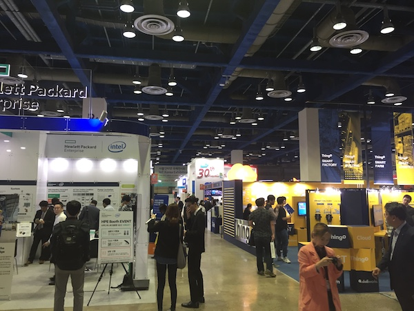

2017 사물인터넷 국제전시회가 10월 11일부터 13일까지 3일간 개최되어 행사 첫날 참관을 하였다. 사물인터넷이라는 기술은 무수히 많이 들어서 이제는 더 이상 낯선 단어는 아니지만, 아직 IoT 기술들에 대한 사용 경험이 없어 추상적인 개념만 가지고 참관을 했다. IoT 시장에서 치열하게 경쟁하고 있는 국내 대형 인터넷 사업자 3사가 크게 부스를 차지하고 있었고, 정보통신산업진흥원 등 국내 정보통신 관련 기관과 HP 등 여러 국외 업체가 참여하였다. 회사 대부분은 나에게 낯선 회사였지만 각 업체에서 개발한 제품과 기술에 대한 프라이드는 대단했다.

 사물인터넷은 다른 기술과 응용, 융합을 위한 가장 기초가 된다. 각 기기에서 만들어진 정보들이 네트워크를 통해 모이게 되면 빅데이터가 되고, 이 빅데이터를 기반으로 학습하여 인공지능이 만들어지고, 이 인공지능을 이용하여 사용자가 원하는 정보를 IoT 기기로부터 받아 제공하는 정보기술체이닝이 이 산업 속에서 이루어지고 있다. 실제로 우리가 자주 접하는 포털사이트, 소셜네트워크서비스, 인터넷 쇼핑몰에서 인공지능 마사지를 안 받은 것이 없을 정도로 활용되고 있으며 이 모든 것은 무심결에 버려질 수 있는 데이터로 만들어진다.

 사물인터넷의 기본은 장치에서 만들어진 정보를 네트워크를 통하여 다른 곳으로 전달하는 것이다. 유선이든 무선이든 어떻게든 생성된 정보를 전달해야 하는데 가정, 사무실과 같이 무선통신에 장애요소가 없고 비교적 좁은 지역 또는 공간에서 데이터 송수신을 하기 위해 WiFi, Bluetooth, ZigBee 같은 통신기술을 사용할 수 있고, 광역네트워크를 사용할 필요가 있는 경우 국내 통신 3사에서 인프라를 구축 완료하여 서비스 중인 LTE-M, LoRa, NB-IoT 와 같은 IoT 전용 네트워크 인프라를 사용할 수 있다. 사물은 고정된 상태로 충분한 전기를 공급받을 수도 있고, 항시 이동하면서 제한된 전기를 공급받을 수도 있으며, 통신 시설이 없거나 설치하기 어려운 터널 속, 위험물 보관지역 등 환경이 열악한 곳에 있을 수 있다. IoT 전용망은 이런 문제를 극복할 수 있도록 설계되었다. IoT 전용 네트워크 서비스는 통달거리가 길고, 저전력이며 저속통신을 지원하는 것이 기존 LTE와 차이가 있다. 특히 NB-IoT는 기존 LTE망을 소프트웨어 업그레이드 만으로 지원할 수 있어, 이미 전국적으로 설치된 인프라를 그대로 사용할 수 있고, 국제표준으로 등록되어 있어 글로벌 서비스에 유리하다.

 전시회에서는 이런 인프라들을 적극 활용하여 다양한 제품 및 플랫폼들을 선보였다. 스마트 미터링, 자산관리, 홈케어, 스마트시티(가로등, 주차장, 쓰레기통), 스마트 팩토리(안전, 물류, 보안, 환경), 축산업 등 지금까지 사람이 직접 관찰하고 측정하고 관리해야 했던 대부분 분야에서 IoT 기술을 활용하고 있을 뿐만 아니라 스마트 그리드와 블록체인기술을 융합한 전력거래서비스, 블록체인기술을 활용한 스마트 보험금 청구서비스와 같이 서로 다른 기술을 융합하여 또 다른 시장을 창출하고 있다.

 여러 기술 중 스마트 미터링은 우리 생활에 밀접하게 다가와 있다. 최근 건축된 아파트에서는 전기, 수도, 가스사용량 등은 자동으로 서버로 수집되어 과금 업체로 송신되고, 그 정보들은 가정 내 모니터로 직접 확인 가능하도록 되어 있어 한 달에 한 번이지만 귀찮은 가스 검침을 할 필요가 없어졌다. 산업현장에서 사용 활용할 수 있는 기술들은 더 다양했다. LGU+에서는 환경 안전 부분에서 다양한 제품들을 선뵈었는데 기존 스마트폰을 활용한 것들이 눈에 많이 띄었다. 공장 내에 위험요소가 있는 곳에 비콘을 설치하고 작업자가 위험구역에 진입할 때 알람과 관리자 모니터에서 작업자 현황을 제공하여 안전사고를 예방하는 서비스, 현장 상황을 실시간으로 관리자와 공유할 수 있도록 한 직캠 서비스, 헬멧에 영상기록장치를 부착하여 작업자가 보는 시선으로 모든 작업상황을 기록할 수 있는 스마트 헬멧 등 큰 비용이 들지 않으면서 유용하게 쓸 수 있는 제품들이 많았다.
 또한, 현장에서 발생하는 모든 정보를 통합 관리할 수 있는 솔루션들도 많이 보였다. 물리 보안 컨설팅과 구축 및 서비스형 솔루션 사업을 진행하고 있는 엠폴시스템은 ICT 기반의 빌딩 및 사무실의 통합 보안 관제 플랫폼 소프트웨어인 'IMP(Integrated Management Platform)'를 선보였다. IMP는 CCTV, 출입통제, 차량 출입 관리 등 빌딩 또는 공장에서 필요한 다양한 물리적 보안 솔루션을 통합해 관리자 및 운영자에게 데이터의 수집, 모니터링, 분석을 쉽고 빠르게 할 수 있도록 제공하였다. 이처럼 수많은 업체에서 기술개발을 통해 좋은 제품과 서비스로 4차 산업혁명을 이끌고 있다.

 하지만 기술의 뒤편에는 항상 해결해야 할 이슈들이 많다. 가장 큰 문제는 보안이다. 요즘 한창 시장이 커지고 있는 홈 CCTV는 언제나 해커들이 공격대상이 될 수 있다. 인가되지 않은 사용자가 외부에서 접근하여 가정 내부를 눈으로 보듯이 살펴볼 수 있게 되면 프라이버시 문제뿐만 아니라 절도범들의 유용한 자료가 될 수 있다. 이 문제를 해결하기 위한 보안솔루션들도 하나둘씩 나오고 있지만 100% 완벽한 보안은 세상에 존재할 수 없으므로 꾸준한 제도적 보완과 기술 개발이 필요하다.
 두 번째로 표준화이다. IoT 분야는 아직 성장하고 있는 단계이기 때문에 모든 기기에 호환되도록 하는 표준이 아직은 정립되고 있지 않다. IoT 전용 네트워크인 LTE-M과 저전력 광역기술인 이른바 NB-IoT는 국제 이동통신 표준화 기구인 3GPP에서 국제표준으로 제정을 했지만, 애플리케이션 단의 표준화는 아직 이루어지지 않고 있다. 다시 말하면 LG에서 IoT용 수신기를 구매하더라도 IoT 기능이 있는 모든 장치를 연결할 수 없고 특별히 호환되는 장치만 연결할 수 있다. 융합기술인 경우는 더 심각하다. 블록체인 기술을 활용해 전기를 판매하려고 해도 아직 이렇다 할 표준이 없어 판매처가 생길 때마다 그 상황에 맞게끔 프로젝트를 수행해야 한다.
 세 번째로 유지보수문제를 들 수 있을 것 같다. 대형 통신업체 3사가 주도적으로 IoT 서비스를 만들어내고 있지만 모든 영역을 다 커버하지는 못한다. 그래서 특수한 기능을 가진 IoT 장비를 도입하려고 하면 IoT 전문기업에서 만든 제품을 사용해야 하는 데 문제는 대부분 업체는 중소기업이라 고객사들이 이 업체가 언제 없어질지 모른다는 우려를 할 수 있다. 한번 납품되거나 설치되면 장기간 사용해야 하는 데 문제가 생겼을 때 납품업체가 없어졌으면 어찌할 방법이 없게 된다. 새로운 기술이 생기면 많이 사용돼야 개선되어 또 다른 신기술이 개발되는데 이런 문제로 시장 성장에 발목을 잡게 되면 폭발적인 기술혁신이 어렵게 된다.

 그럼에도 불구하고 세계 정보통신 시장에서 가장 핫 한 기술 중 하나인 만큼 개인적으로도, 회사에서도 도전해볼 만한 가치는 충분히 있다. 데이터를 모으기만 하면 모두 사물인터넷은 아니다. 모인 정보들이 사용자에게 유용한 가치를 전달할 때 비로소 그 효용이 있다. 그 가치를 만들어내기 위해 관심을 가지고 꾸준히 연구해야 할 것이다.
