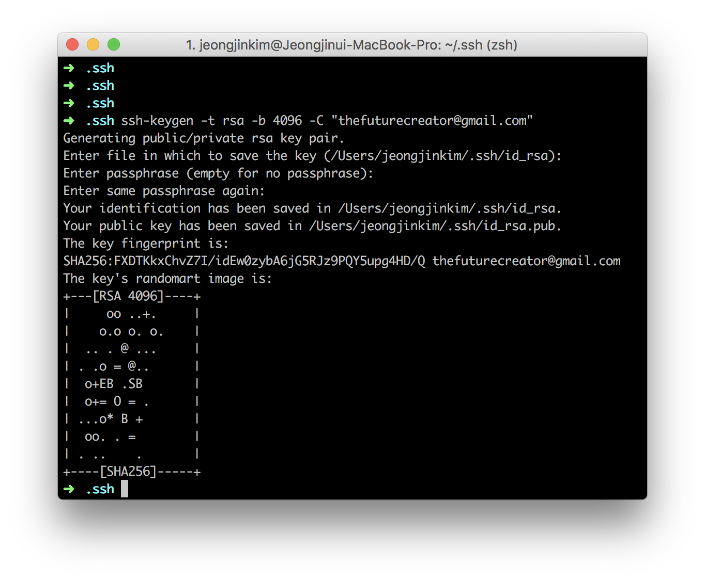
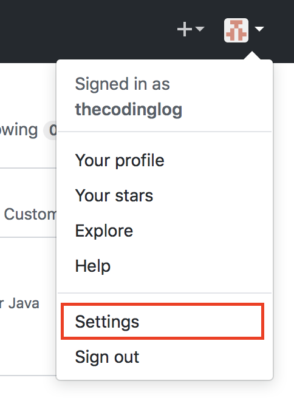
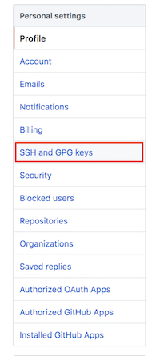
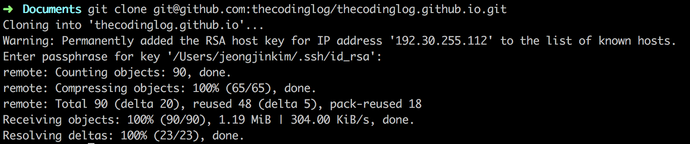

<<<<<<< HEAD
### github에 로컬pc 공개키 만들고 github에 등록하기
#### SSH key가 있는지 확인
=======
# github에 로컬pc 공개키 만들고 github에 등록하기
## SSH key가 있는지 확인
>>>>>>> be82d5ee8ee6821117874155a08fafdd6def4e63
```sh
ls -al ~/.ssh
```
기존에 만든 키가 있으면
> id_dsa.pub
id_ecdsa.pub
id_ed25519.pub
id_rsa.pub

와 같은 파일을 볼 수 있음

<<<<<<< HEAD
#### SSH key 만들기
=======
## SSH key 만들기
>>>>>>> be82d5ee8ee6821117874155a08fafdd6def4e63
```sh
ssh-keygen -t rsa -b 4096 -C "your_email@example.com"
```



Enter file in which to save the key(/Users/[user]/.ssh/id_rsa):
에서 그냥 엔터치면 id_rsa 이름으로 파일 생성됨

<<<<<<< HEAD
#### github 계정에 키 등록하기
=======
## github 계정에 키 등록하기
>>>>>>> be82d5ee8ee6821117874155a08fafdd6def4e63
이름을 바꾸지 않았다면 id_rsa.pub 파일의 내용을 클립보드로 카피한다.
줄바꿈이나 다른 어떠한 문자도 넣지 않도록 유의한다.

- mac인 경우
```sh
 pbcopy < ~/.ssh/id_rsa.pub
```

- windows인 경우
```sh
clip < ~/.ssh/id_rsa.pub
```
github에 로그인 후 우측 상단의 프로필 사진 부분을 클릭하면 메뉴가 나오는데 거기서 *세팅* 을 선택한다.


SSH and GPG keys 를 선택한다.


원하는 제목을 적고 위에서 클립보드로 카피한 키를 붙여 넣는다.
이렇게 하고 github에서 clone을 하면 잘 동작한다.

끝.
