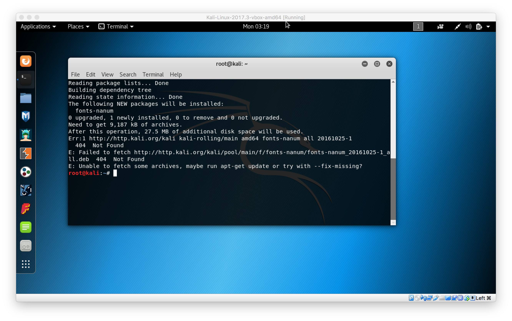

Kali linux에 한글폰트를 apt-get를 이용하여 설치할 수 있다.

    apt-get install fonts-nanum*

그런데 가끔 메인 repository 가 불안정하여 폰트를 설치할 때 404 오류가 뜰 수 있다.

이럴때 [미러사이트](http://http.kali.org/README.mirrorlist)를 소스 리스트에 등록하여 다른 repository를 바라보게 변경 할 수 있다.

    /etc/aps/sources.list

미러사이트 목록 중 되는 곳도 있고 안되는 곳도 있으니 여러가지 넣어 봐서 빠른 곳으로 선정하면 된다.

    deb http://kali.mirror.garr.it/mirrors/kali kali-rolling main non-free contrib

주소를 변경 한 뒤 업데이트를 해주고

    sudo apt-get update

다시 폰트를 인스톨하면 된다.
